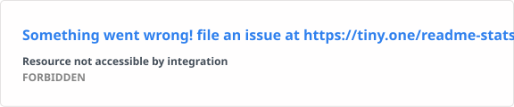

<!-- ═══════════════════════════════════════════════════════════════════════════════
     HEADER
     ════════════════════════════════════════════════════════════════════════════ -->

 

 

<!-- ═══════════════════════════════════════════════════════════════════════════════
     ABOUT
     ════════════════════════════════════════════════════════════════════════════ -->

## 🧑‍💻 About Me

I'm Alejandro, a full-stack web developer from **Cádiz, Spain**, focused on building useful, maintainable software and learning by shipping real projects.

I enjoy working across the whole stack: from frontend architecture and UX to REST APIs, databases, containers and deployment. I'm especially interested in **clean code, automation, cybersecurity and developer tooling**.

- 🇪🇸 Based in **Spain**
- 🎓 **DAW** (Web Application Development) Technician
- 🖥️ **SMR** (Microcomputer Systems & Networks) Technician
- 💻 **Junior Full-Stack Web Developer**
- 🧱 Frontend, backend, databases and deployment
- 🚀 Self-hosted projects running with **Docker, Nginx and CI/CD**
- 🤖 Interested in **AI, automation, robotics and cybersecurity**
- 🌱 Currently learning **Flutter** and exploring **.NET**
- 💼 **Open to junior developer opportunities**

 

<!-- ═══════════════════════════════════════════════════════════════════════════════
     BEYOND THE CODE
     ════════════════════════════════════════════════════════════════════════════ -->

## 🛡️ Beyond the Code

- 🛡️ Cybersecurity, CTFs and security research
- 🧠 Competitive programming and algorithmic problem solving
- 🎥 Creating programming content and educational material
- 👨‍🏫 Helping other developers learn and improve
- 🧪 Constantly experimenting with new tools, architectures and ideas

 

<!-- ═══════════════════════════════════════════════════════════════════════════════
     TECH STACK
     ════════════════════════════════════════════════════════════════════════════ -->

## 🔩 Tech Stack

### 💻 Languages

### 🧩 Frameworks & Libraries

### 🗄️ Databases

### ⚙️ DevOps & Tools

### 🖥️ Operating Systems

### 🌱 Currently Learning

 

<!-- ═══════════════════════════════════════════════════════════════════════════════
     FEATURED PROJECTS
     ════════════════════════════════════════════════════════════════════════════ -->

## 🗂️ Featured Projects

<table>
<tr>
<td width="50%" valign="top">

### 🚀 AutoDeploy

A **self-hosted VPS deployment and management platform** designed to simplify provisioning, deployment and application management from a single dashboard.

`Angular` · `Spring Boot` · `MongoDB` · `Docker` · `GitHub Actions`

🔗 **[autodeploy.kruhale.com](https://autodeploy.kruhale.com)**

</td>

<td width="50%" valign="top">

### 💪 Cofira

A **full-stack fitness and nutrition platform** with adaptive training, AI-generated meal plans and detailed progress tracking.

`Angular 20` · `Spring Boot 4` · `Java 21` · `PostgreSQL` · `Docker`

🔗 **[cofira.kruhale.com](https://cofira.kruhale.com)** · 💻 **[Source Code](https://github.com/Kruhale/Cofira)**

</td>
</tr>

<tr>
<td width="50%" valign="top">

### 🌐 kruhale.com

My **personal portfolio and development lab**, used to showcase projects, experiments, background and ways to get in touch.

`Web` · `Self-hosted`

🔗 **[kruhale.com](https://kruhale.com)**

</td>

<td width="50%" valign="top">

### 🧪 More Projects

I regularly experiment with new ideas around **web development, automation, AI, cybersecurity and developer tooling**.

🔗 **[Explore all repositories →](https://github.com/Kruhale?tab=repositories)**

</td>
</tr>
</table>

 

<!-- ═══════════════════════════════════════════════════════════════════════════════
     GITHUB STATS
     Generated locally by GitHub Actions
     ════════════════════════════════════════════════════════════════════════════ -->

## 💹 GitHub Stats

<picture>
  <source media="(prefers-color-scheme: dark)" srcset="./profile/stats-dark.svg" />
  
</picture>

<picture>
  <source media="(prefers-color-scheme: dark)" srcset="./profile/top-langs-dark.svg" />
  
</picture>

  

<picture>
  <source media="(prefers-color-scheme: dark)" srcset="./profile/streak-dark.svg" />
  
</picture>

 

<!-- ═══════════════════════════════════════════════════════════════════════════════
     TROPHIES
     ════════════════════════════════════════════════════════════════════════════ -->

## 🎖️ Trophies

 

<!-- ═══════════════════════════════════════════════════════════════════════════════
     SNAKE
     ════════════════════════════════════════════════════════════════════════════ -->

## 🐍 Contribution Snake

<picture>
  <source media="(prefers-color-scheme: dark)" srcset="./profile/github-snake-dark.svg" />
  <source media="(prefers-color-scheme: light)" srcset="./profile/github-snake.svg" />
  
</picture>

 

<!-- ═══════════════════════════════════════════════════════════════════════════════
     CONNECT
     ════════════════════════════════════════════════════════════════════════════ -->

## 🌐 Connect With Me

I'm open to **junior developer opportunities, collaborations and interesting technical projects**.

 

 

> **Build. Break. Learn. Ship.**

 

